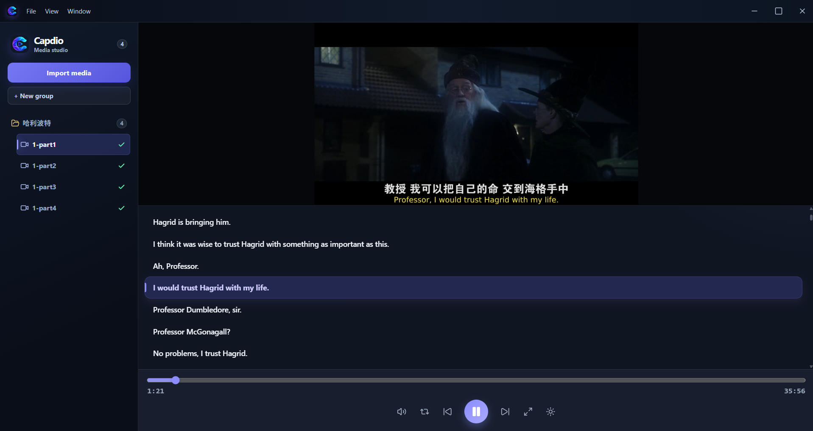
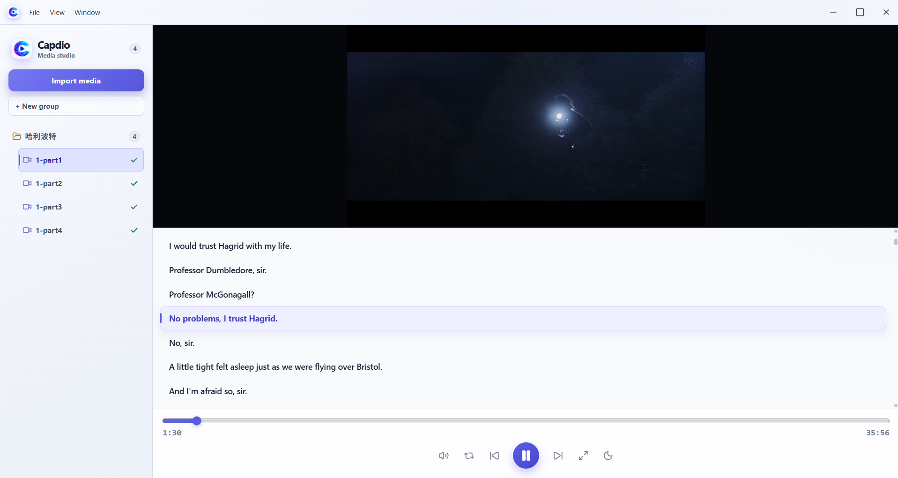

# Capdio

Capdio is a desktop audio/video library for listening, reading synchronized captions, and looking up unfamiliar words. It combines local Whisper transcription with an interactive caption book and a reusable Youdao dictionary window.

Built with Electron, React, Vite, OpenAI Whisper, and FFmpeg. The included installer pipeline targets **Windows x64**.

<p align="center">
  
  
</p>

## Features

- **Media library:** import multiple files, organize them into groups, rename entries, and move selected media by dragging it between groups or into the ungrouped area.
- **Local transcription:** generate English captions with Whisper's `base` model, view progress, queue multiple files, and cancel or remove queued jobs.
- **Caption book:** follow the active caption, click a caption to seek and play, and repeat the current segment.
- **Playback controls:** play/pause, seek, skip five seconds, adjust volume, and use player or video fullscreen.
- **Remembered settings:** restore the last selected media, saved playback position, per-file volume, theme, sidebar width, and video/caption split sizes.
- **Phone imports:** scan a QR code to upload audio/video over the same Wi-Fi network, with upload progress and cancellation.
- **Dictionary lookup:** look up a selection or a whole caption in one reusable Youdao window, with history buttons and keyboard navigation.
- **Light and dark themes:** Youdao follows the app theme using injected styles and color inversion, with dark scrollbar styling and its top banner hidden.
- **Custom window controls:** draggable title bars, minimize/maximize/close buttons, and one running Capdio instance per user session.

## Getting started

If you have a built Windows installer, run `Capdio Setup <version>.exe` and follow the installation prompts. The packaged app includes the transcriber, Whisper model, and FFmpeg; end users do not need to install them separately.

### 1. Import and organize media

Choose **File > Import media**, or press **Ctrl+O**, then select one or more files. Capdio copies them into its library; the original files remain in place.

Choose **File > Download from URL** to import a video from a webpage or direct media URL. Capdio tries `yt-dlp` when it is available, then falls back to inspecting the rendered page and its media requests. FFmpeg handles HLS/DASH streams and combines media when necessary. DRM-protected media is not supported; only download media you are permitted to save.

Supported import extensions:

- Audio: `.mp3`, `.wav`, `.m4a`, `.aac`, `.flac`, `.ogg`
- Video: `.mp4`, `.mkv`, `.avi`, `.mov`, `.webm`

Playback also depends on the codecs inside the file and Electron's media support.

Use the library's group controls to organize files. Right-click a media item or group for its available actions. Ctrl-click selects multiple media items. Drag selected items to a group to move them.

To save a copy outside the library, right-click a media item and choose **Export**. The save dialog suggests its current display name with the original audio/video extension. Export copies the original file without converting it. Right-click a group and choose **Export** to save all its media into a folder named after the group inside your chosen destination. Existing folder names and duplicate media names receive numbered suffixes so files are not overwritten.

Deleting media removes its library copy, metadata, and captions. Deleting a group also deletes the media inside it. The app asks for confirmation before deleting.

### 2. Generate captions

Select media without captions and click **Transcribe**, or use its right-click menu. Use **Transcribe all** on a group or the ungrouped library area to queue eligible files. Files that already have captions are skipped.

Transcription runs locally, one queued item at a time. Progress appears in the library and caption area. Right-click an active or queued item to cancel transcription or choose **Dequeue / Exclude**; group menus also support cancellation.

The current transcriber uses Whisper's `base` model and explicitly selects **English**. It does not currently offer a language selector.

### 3. Listen with the caption book

- Click a caption to jump to that segment and start playback.
- Enable **Repeat active caption** to practice the current segment.
- Use the timeline, volume slider, and five-second skip controls to navigate.
- Drag the divider between video and captions to change their proportions; the normal and fullscreen layouts remember their sizes separately.
- Drag the library divider to resize the sidebar.

### 4. Look up words and captions

Select text in the caption book and press **Ctrl+S** to look it up and clear the selection. Right-clicking a caption looks up that entire caption instead.

**Ctrl+D** opens Youdao without a lookup, or brings its existing window forward. The first word lookup opens the results page directly; later lookups update the existing page.

Inside Youdao:

- **Ctrl+S** looks up selected page text and clears the selection; without selected text it does nothing.
- **Ctrl+D** returns focus to Capdio.
- Use the arrow buttons or **Alt+Left / Alt+Right** to traverse window history. Buttons disable when that direction has no available history.

Whenever Capdio loses focus, playing audio/video temporarily pauses while the play/pause button stays in its playing state. Returning to Capdio resumes playback only if losing focus caused the pause; manually paused media stays paused. Closing Capdio also closes Youdao, while either window can be brought to the foreground independently.

Youdao requires an internet connection. Its dark appearance is a local adaptation of a third-party page, so some graphics may differ from their original colors.

### 5. Import from a phone

1. Connect the phone and computer to the same Wi-Fi network.
2. Choose **File > Import from phone**.
3. Scan the QR code, or open the displayed URL on the phone.
4. Select audio/video files and follow their upload/import progress in Capdio.

The dialog can copy the upload URL and cancel pending uploads. If the phone cannot connect, check that the displayed address is reachable from the phone and that Windows Firewall allows the app's local-network connection.

## Keyboard shortcuts

| Context | Shortcut | Action |
| --- | --- | --- |
| Capdio | Ctrl+O | Import media |
| Capdio | Ctrl+S | Look up selected caption-book text and clear the selection |
| Capdio | Ctrl+D | Open or focus Youdao without a lookup |
| Capdio | Ctrl+Shift+T | Toggle light/dark theme |
| Capdio | Ctrl+F | Toggle player fullscreen |
| Capdio, video selected | F11 | Toggle video fullscreen |
| Player focused | Space | Play/pause |
| Player focused | Left / Right | Seek backward/forward five seconds |
| Youdao | Ctrl+S | Look up selected page text; otherwise do nothing |
| Youdao | Ctrl+D | Focus Capdio |
| Youdao | Alt+Left / Alt+Right | Back / forward through history |
| App running | Ctrl+Shift+I | Toggle developer tools for the focused window |
| Inline rename | Enter / Escape | Commit / cancel rename |

## Data and network use

Media, captions, and metadata are stored locally. Transcription uses the local Whisper runtime; it does not send recordings to a hosted transcription API. Development may download the model on first use; packaged builds include it.

Dictionary lookups send the requested text to Youdao. Phone imports transfer files through a local HTTP server on your computer.

During development, the library is stored in `library/` beside `main.js`. Installed builds use the configured library location, falling back to Electron's user-data directory under `library/`.

```text
library/
  manifest.json             # Groups and media entries
  media/                    # Imported copies, named by media ID
  caption/                  # <id>.captions.json
  metadata/                 # <id>.json: names, grouping, volume, position, etc.
```

Back up the entire library directory to preserve media and its associated captions and metadata. UI preferences are stored separately in the renderer's local storage.

## Development

### Requirements

- Node.js 22.12 or newer and npm, as used by the project's build setup.
- Python 3.13 x64 for the local Whisper runtime and Windows packaging.
- Python with `openai-whisper` installed, available as `python` on `PATH`.
- FFmpeg available as `ffmpeg` on `PATH` for development transcription.

Install dependencies:

```powershell
npm ci
python -m pip install openai-whisper
```

Start Vite in one terminal:

```powershell
npm run dev
```

Start Electron from the project directory in another terminal:

```powershell
npm start
```

Development Electron loads `http://localhost:5173`, so keep Vite running. `npm run build` builds the renderer but does not change this development startup behavior.

## Build a Windows installer

Before building a Windows installer, start the development app once to let
Electron finish setting up its local runtime files. Run these commands from
the project directory in separate terminals:

```powershell
npm run dev
npm start
```

Stop both processes after the app opens, then create the packaging environment
and build the installer as described below.

From a fresh clone, create an isolated Python 3.13 packaging environment.
The Python requirements install cx_Freeze, Whisper, and Torch; no Python
packages from the global interpreter are used:

```powershell
git clone <repository-url>
cd Capdio
npm ci
py -3.13 -m venv .venv-packaging
.\.venv-packaging\Scripts\python -m pip install --upgrade pip
.\.venv-packaging\Scripts\python -m pip install -r python\requirements-build.txt
$env:CAPDIO_PYTHON = (Resolve-Path .\.venv-packaging\Scripts\python.exe)
npm run dist:win
```

Set `CAPDIO_PYTHON` again in each new terminal used for packaging. The complete build compiles the renderer, bundles the Python transcriber with cx_Freeze, stages the Whisper `base` model, bundles FFmpeg, and produces:

```text
release/Capdio Setup <version>.exe
```

After UI or Electron changes, reuse existing transcriber/model resources with:

```powershell
npm run repackage:win
```

After Python changes, run the full `npm run dist:win` build. See [PACKAGING.md](PACKAGING.md) for more packaging details.

| Command | Purpose |
| --- | --- |
| `npm run dev` | Start the Vite development server |
| `npm start` | Start Electron |
| `npm run build` | Build the React renderer |
| `npm run build:python` | Bundle the Python transcriber with cx_Freeze |
| `npm run download:model` | Stage the Whisper model |
| `npm run package:resources` | Build the transcriber and stage the model |
| `npm run dist:win` | Build the complete Windows installer |
| `npm run repackage:win` | Rebuild the renderer and installer using existing runtime resources |

## Project structure

| Path | Purpose |
| --- | --- |
| `main.js` | Electron lifecycle, library storage, IPC, imports, uploads, and transcription processes |
| `src/App.jsx` | Library UI, menus, queues, settings, and app shortcuts |
| `src/MediaPlayer.jsx` | Playback and interactive caption book |
| `dictionary.js` | Youdao window, lookup, navigation, theme injection, and shortcuts |
| `dictionary.html` | Custom dictionary title bar and window controls |
| `python/transcribe.py` | Local Whisper transcription |
| `scripts/` | Python packaging and model staging |
| `installer.nsh` | Windows installer customization |

Generated libraries, model files, Python binaries, and installers are ignored by Git.

## License

The package declares the **ISC** license. Bundled third-party components retain their respective licenses.
